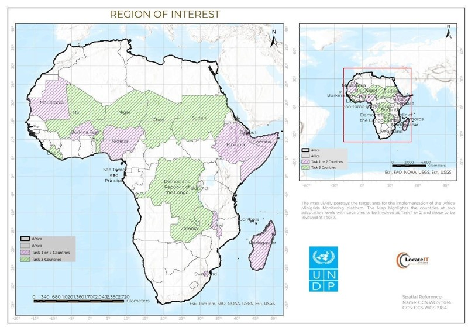

**Introduction**
=================

Overview
--------------

The Africa Minigrids Program (AMP) Digital Platform is a comprehensive, 
web-based system designed to support the monitoring, evaluation, 
and management of renewable energy minigrids across multiple African countries. 
Developed within the framework of the United Nations Development Programme (UNDP), 
the platform enables stakeholders to collect, integrate, analyze, and visualize data 
related to minigrid performance and impact.

The platform is implemented using an open-source, modular architecture based on the Prospect Energy 
platform, ensuring flexibility, scalability, and long-term sustainability. It operates across both 
regional and national levels, allowing for seamless data aggregation, coordination, and 
decision-making across the AMP ecosystem.

Purpose of the Platform
----------------------------

The primary purpose of the AMP Digital Platform is to:

* Monitor the performance of minigrid systems using standardized indicators
* Support data-driven decision-making for governments, developers, and partners
* Enable transparent verification of results for Result Based Financing (RBF) mechanisms
* Facilitate coordination among stakeholders at national and regional levels
* Improve operational efficiency and reduce costs through digitalization

By centralizing data and providing real-time insights, the platform plays a critical role in strengthening
accountability, enhancing transparency, and accelerating the deployment of renewable energy solutions.

Scope and Coverage
-----------------------

The AMP Digital Platform is deployed as a multi-layered system consisting of:

* A **Regional Platform** that aggregates data across participating countries and provides a centralized view of program performance at the continental level.

* **National Platforms**, tailored to country-specific requirements and used for operational monitoring, reporting, and stakeholder engagement.

The platform supports the full lifecycle of minigrid projects, including:

* Planning and site identification
* Deployment and commissioning
* Operational monitoring and performance tracking
* Financial verification and reporting

Key Capabilities
---------------------
The platform provides a range of core functionalities, including:

* Real-time monitoring of minigrid performance indicators
* Integration with data sources such as smart meters, inverters, and manual uploads
* Centralized data storage and management
* Customizable dashboards and analytics tools
* Automated data synchronization and validation
* Secure access and role-based user management

Guiding Priniciples
------------------------
The design and implementation of the AMP Digital Platform are guided by the following principles:

* **Open Source architecture** to promote transparency, collaboration and avoid vendor lock-in
* **Scalability** to support expansion accross multiple countries and increasing data volumes
* **Interoperabiltity** to ensure compatibility with diverse systems and technologies
* **Security and Compliance** with international and national data protection standards
* **Sustainability** to ensure continued operation beyond the duration of the AMP program

The AMP Digital Platform represents a critical component of the Africa Minigrids Program, 
enabling the effective use of data and digital technologies to drive sustainable energy access. 
By providing a unified system for monitoring, analysis, and reporting, the platform supports 
the program’s objective of scaling up minigrid deployment while ensuring transparency, efficiency, and long-term impact.
