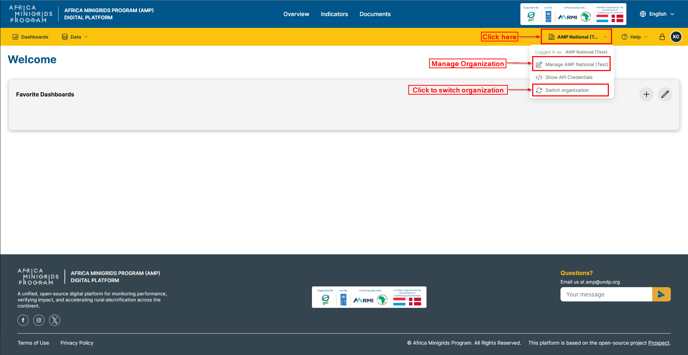
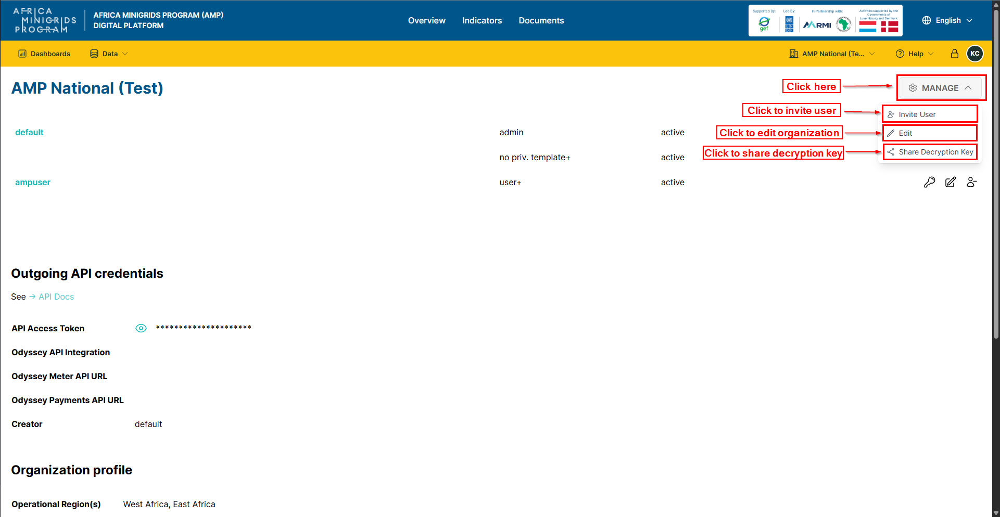
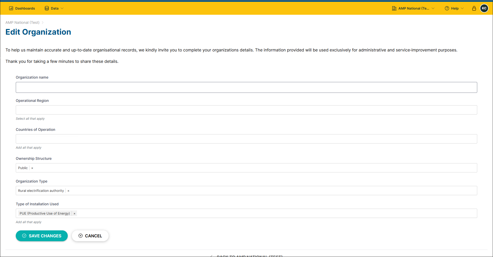
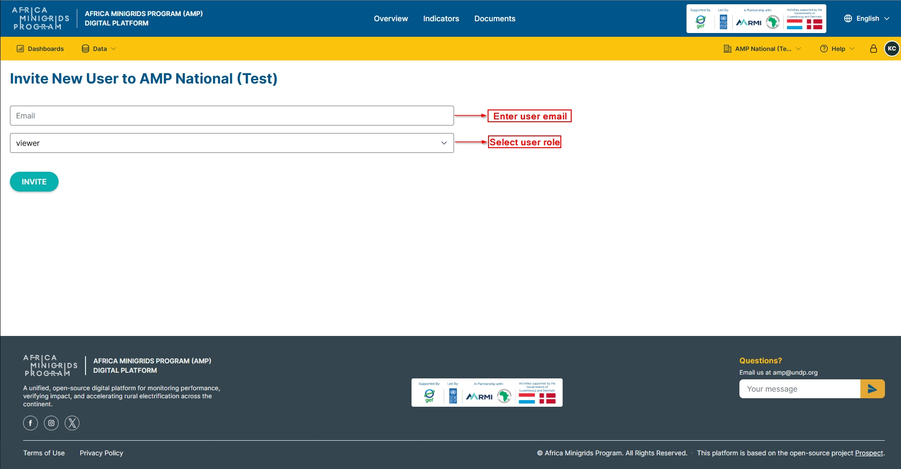
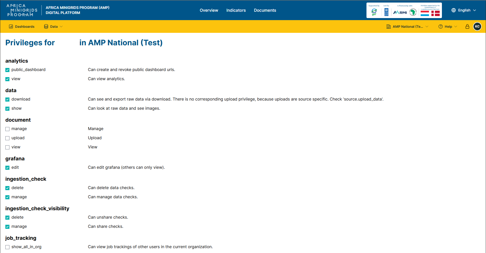
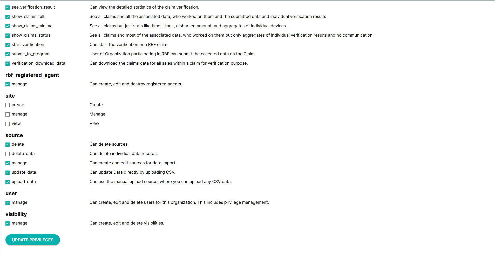
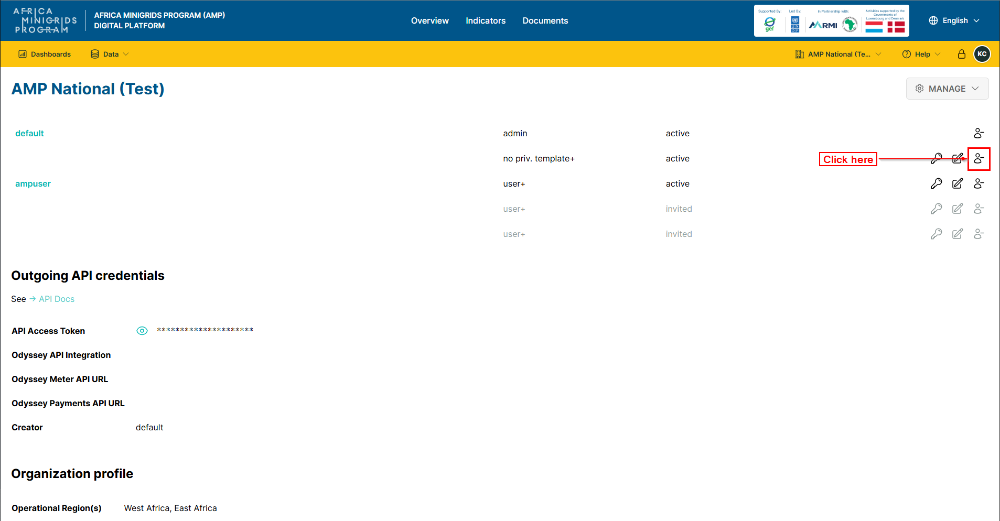

**Accounts**
-----------------

**Manage Organization**
~~~~~~~~~~~~~~~~~~~~~~~~~

**Edit Organization**
^^^^^^^^^^^^^^^^^^^^^^

1. On the homepage click the dropdown button with your organization name.

2. On the dropdown menu click ``Manage Organization`` to open the organization page

.. note::

    The button may have your organization name on it.

3. Click ``Manage`` and select ``Edit``.

4. Fill the form provided and click ``SAVE CHANGES`` to save the changes.

.. hint::

    You can click ``CANCEL`` to go back or cancel the changes.

**Manage users**
~~~~~~~~~~~~~~~~~~~

**Invite user**
^^^^^^^^^^^^^^^^^
1. On the homepage click the dropdown button with your organization name.

2. Click ``MANAGE`` and select ``Invite User``

3. Fill in the form provided and click ``INVITE``.

**Update user privileges**
^^^^^^^^^^^^^^^^^^^^^^^^^^^^^
1. On the homepage click the dropdown button with your organization name

2. Click |key| to open the privileges form

3. Edit the form provided to change the user's privileges

4. Click ``UPDATE PRIVILEGES`` at the bottom of the form to save

**Remove user**
^^^^^^^^^^^^^^^^^

1. On the homepage click the dropdown button with your organization name

2. Click |user-minus| to remove a user

