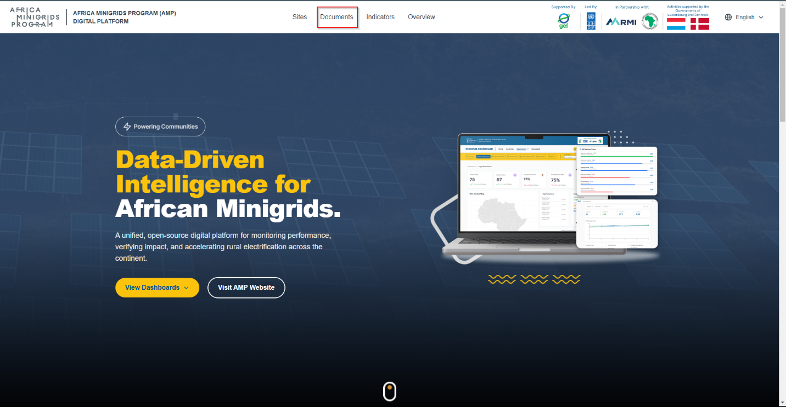
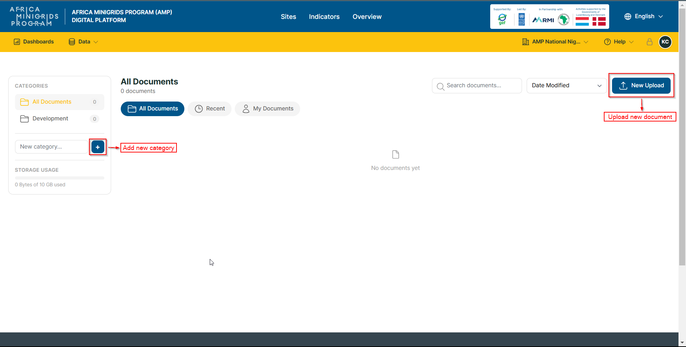
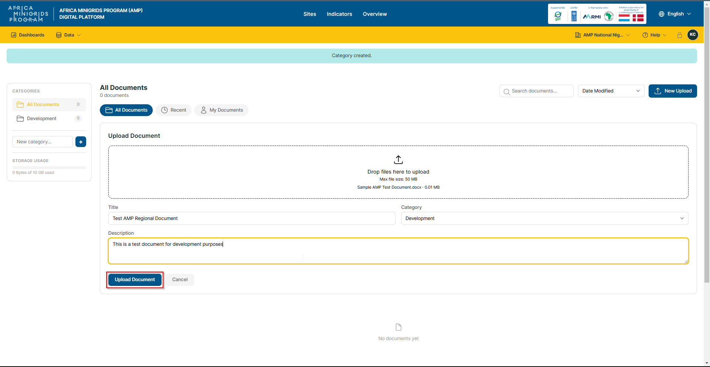
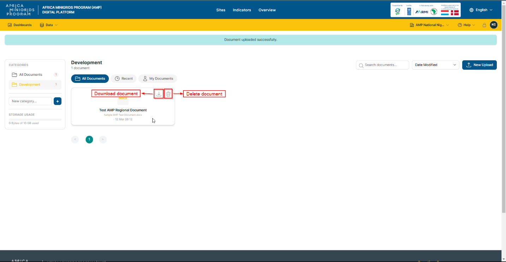

**Document Management**
-------------------------

1. Click "Documents".

2. Click:

-  **New upload:** to upload a new document

-  **New Category:** to create a new category

3. Fill in the document form, then click **Upload Document** to submit the document and its details.

4. If the upload is successful, you will be redirected to the documents
      page, where your document will appear among the documents on the
      page.

5. On the documents page, you can hover over a single document and click:

-  The **Download icon** to download a document
-  The **Delete icon** to delete a document