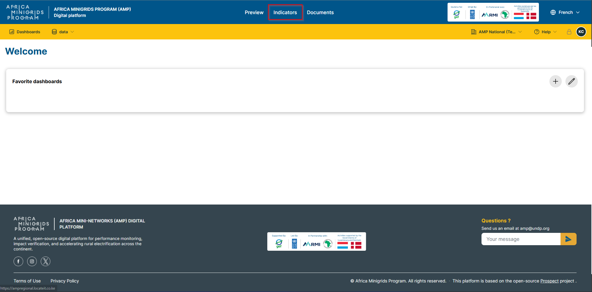
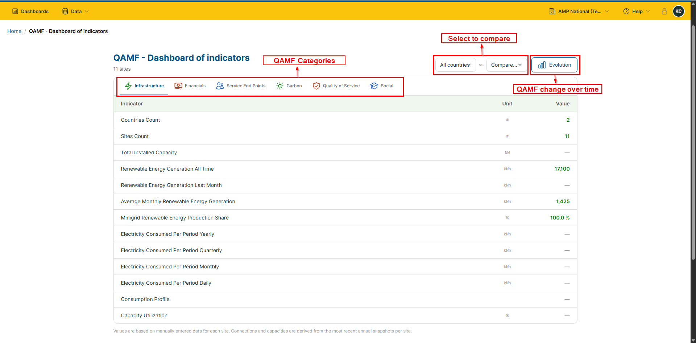
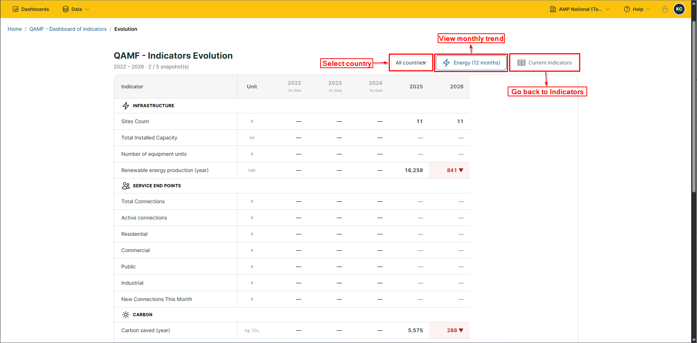

**Indicators**
-------------------

1. Click ``Indicators`` to open the QAMF Dashboard of Indicators.

2. On the Dashboard of Indicators, you can:

-  Toggle categories by changing the QAMF categories
-  Compare countries by selecting the countries to compare
-  View historical evolution by clicking the ``Evolution`` button

.. admonition:: QAMF Categories
   :class: greenbox

   .. list-table:: 
      :widths: 30 70
      :header-rows: 1

      * - Category
        - Meaning
      * - **Infrastructure**
        - Infrastructure and their performance
      * - **Financials**
        - Financial indicators
      * - Service End Points
        - People and zones served
      * - Carbon
        - Carbon Emissions
      * - Quality of Service
        - System performance
      * - Social
        - Social Impact of the project
    

3. On clicking the ``Evolution`` button, you will be redirected to the QAMF trends page, where you can:

-  View monthly trends by clicking the ``Energy (12 months)`` button.
-  Select a specific country to see country-specific information
-  Go back to the ``Dashboard of Indicators`` page by clicking ``Current Indicators``.

