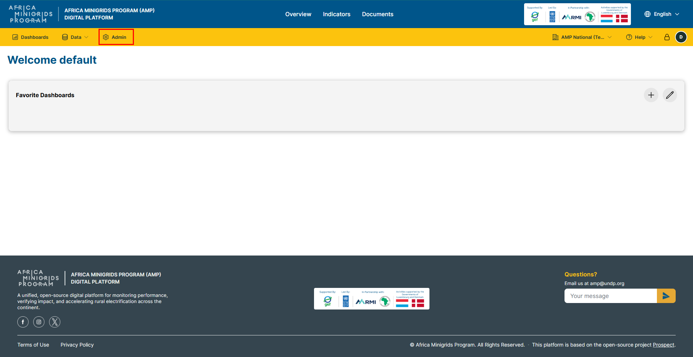
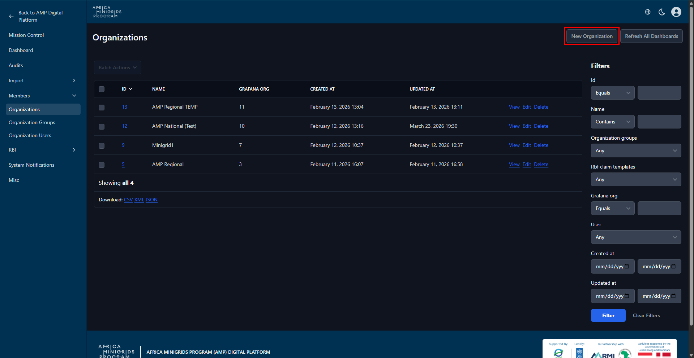
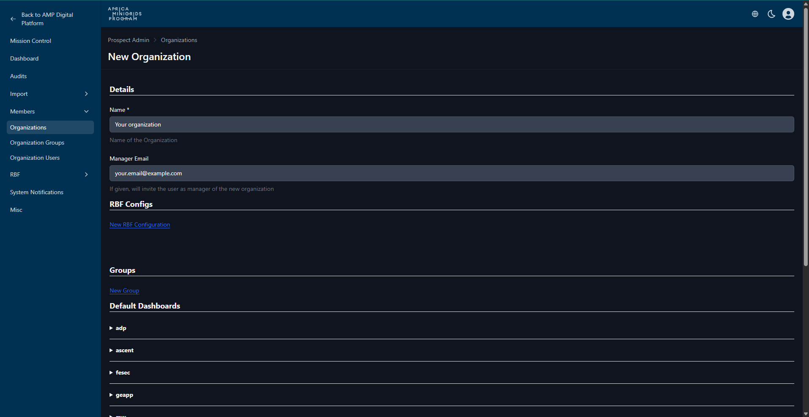
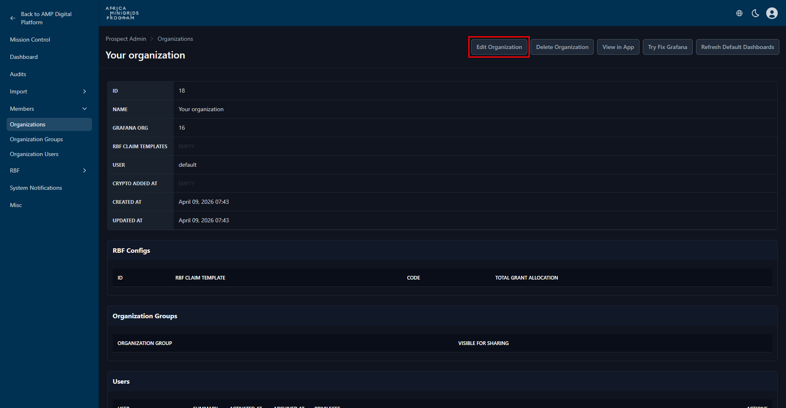
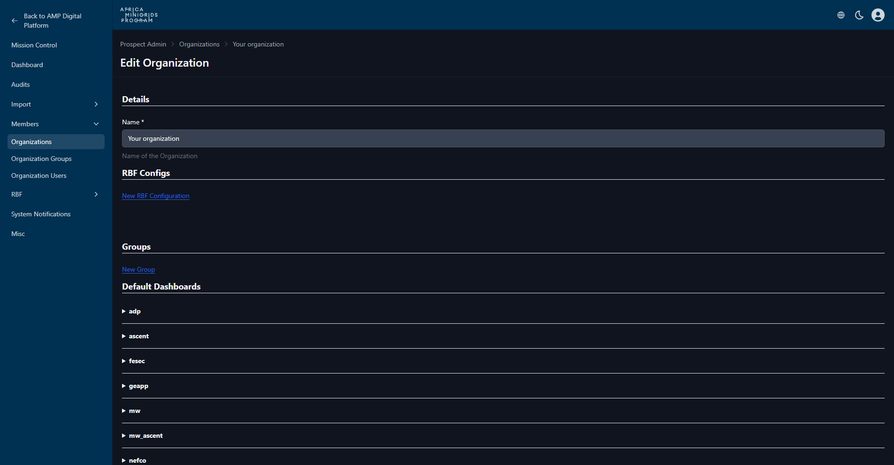

Organization Management
----------------------------

Create Organization - Admin
~~~~~~~~~~~~~~~~~~~~~~~~~~~~~~~~~
1. On the homepage, click ``Admin`` on the yellow navigation bar.

2. Click ``New Organization`` to open the organization creation form.

3. Fill in the form provided and click |create_organization_btn| to create the organization.

Edit Organization - Admin
~~~~~~~~~~~~~~~~~~~~~~~~~~~~~~
1. On the homepage, click ``Admin`` on the yellow navigation bar.

2. On the organizations table, click your organization name to open the organization page.

3. Click ``Edit Organization`` to open the organization edit form.

4. Fill in the form provided and click |update_organization_btn| to save the changes.

Delete Organization - Admin
~~~~~~~~~~~~~~~~~~~~~~~~~~~~~~~~~

1. On the homepage, click ``Admin`` on the yellow navigation bar.

2. On the organizations table, click your organization name to open the organization page.

3. Click |delete_organization_btn| to delete the organization.

.. Note::
    You may be prompted to confirm the deletion. Click ``OK`` to proceed with the deletion or ``Cancel`` to abort.
    Deleting an organization is irreversible. All data associated with the organization will be lost.

Edit Organization
~~~~~~~~~~~~~~~~~~~~~~~

1. On the homepage click the dropdown button with your organization name.

.. image:: ../_static/regional/organizations/organization_management_home.png

2. On the dropdown menu click ``Manage Organization`` to open the organization page

.. note::

    The button may have your organization name on it.

3. Click ``Manage`` and select ``Edit``.

.. image:: ../_static/regional/organizations/organization_with_manage_clicked.png

4. Fill the form provided and click ``SAVE CHANGES`` to save the changes.

.. image:: ../_static/regional/organizations/edit_organization_form.png

.. hint::

    You can click ``CANCEL`` to go back or cancel the changes.