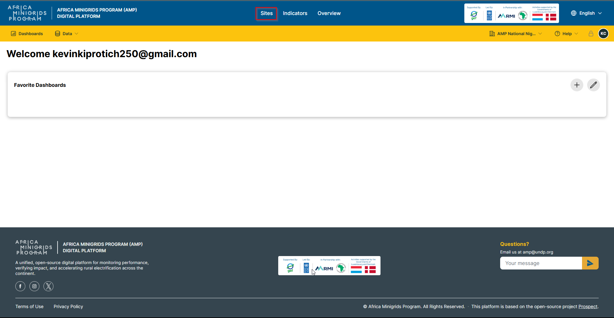
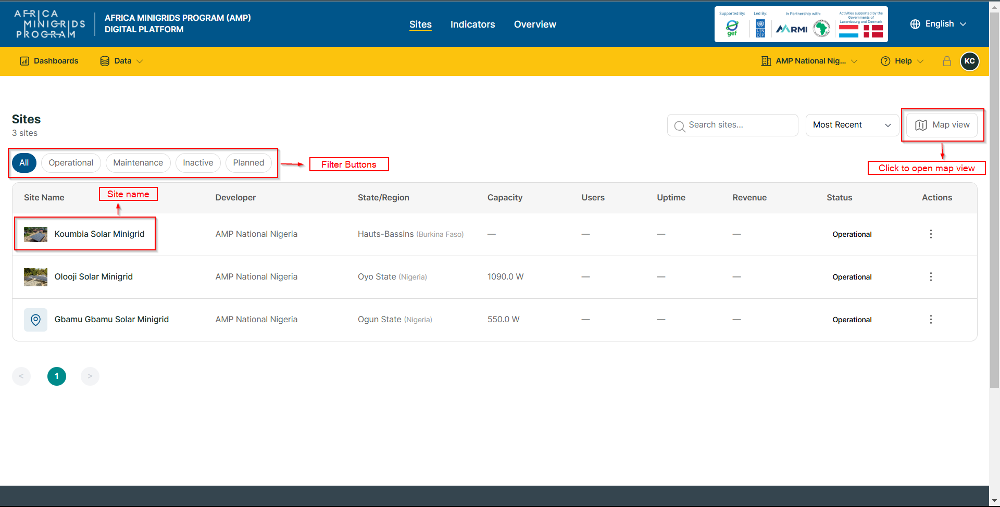
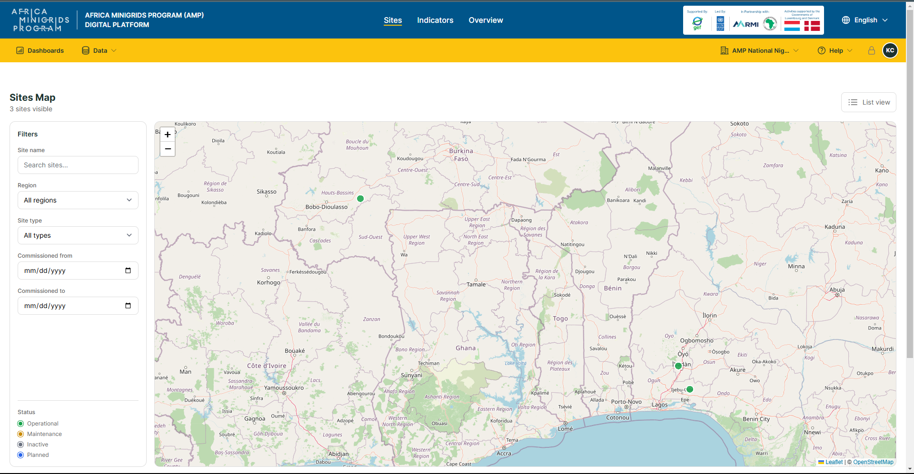
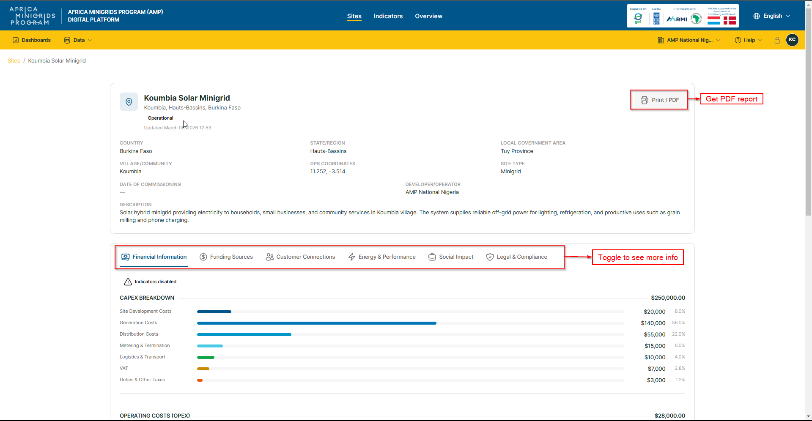

**Site Management**
------------------------

1. Click ``Sites`` to open the sites page

2. On the ``Sites`` page, you can

-  View the sites in map view by clicking the **Map View** button

-  Filter the sites by status by clicking the filter buttons

-  Click on a site name to see more details

3. On the single-site page, you can:

-  Print the site report by clicking the **Print/PDF** button

-  Click the toggle buttons to see more information