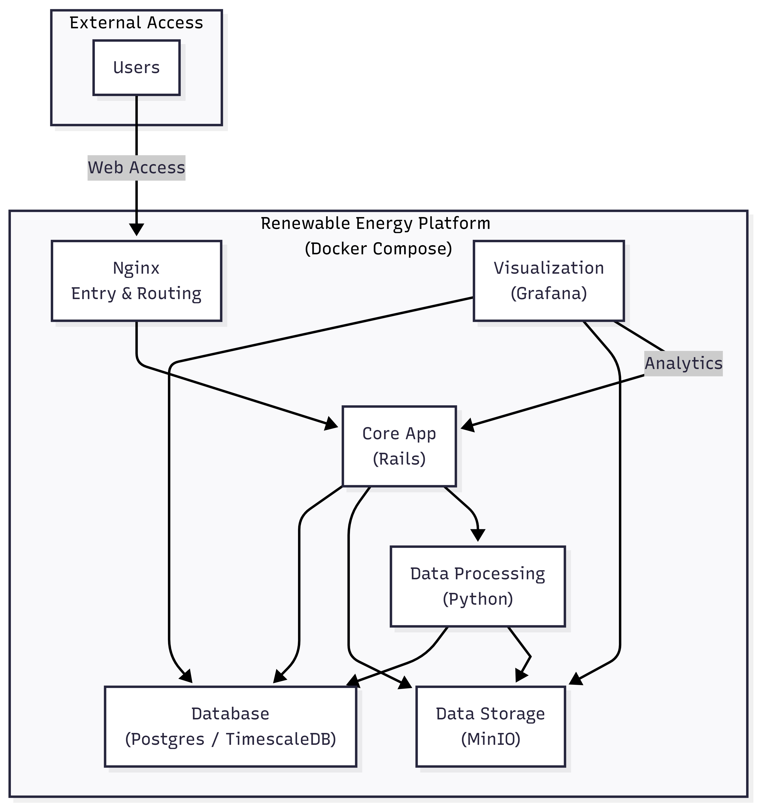
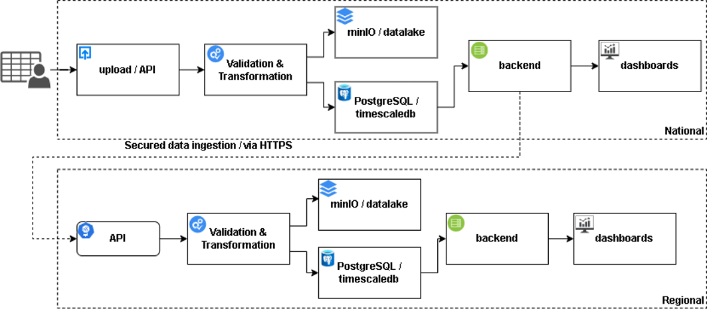

**System Architecture**
========================

.. _Prospect Energy Platform: https://prospect.energy/

The AMP Digital Platform is designed as a `modular, web-based system` for collecting, processing,
storing, and visualizing minigrid data. It is built on the `Prospect Energy Platform`_ and supports
both national and regional use. 

At the national level, each country platform is used to manage local minigrid data, monitor performance, 
and support reporting. At the regional level, a central platform brings together selected data from the
national platforms to provide a broader view of program performance across countries.

Main Components
----------------

..  list-table:: System Architecture
    :widths: 20 80
    :header-rows: 1

    * - Component
      - Description
    * - Core (Ruby Platform)
      - Main application where users interact with the platform. It handles the business logic, web interface, APIs and user management.
    * - Data worker
      - This service processes incoming data, runs background tasks, and supports data transformation and validation.
    * - PostgreSQL/TimescaleDB
      - This is the main database used to store structure data, including platform records and time-series data from minigrid operations.
    * - MinIO
      - This is used for storing files and objects such as uploads, reports, and other large data assets.
    * - Grafana
      - This provides dashboards and visualizations for monitoring performance indicators and trends.
    * - Nginx
      - This acts as the reverse proxy and routes to the appropriate services.
    * - Faktory
      - This manages background jobs such as scheduled data processing and task queues.

Data Flow Architecture
-----------------------

The platform follows a simple flow:

1. Data is collected from minigrid equipment, external systems, or manual uploads.
2. The data is sent to the platform through the application or APIs.
3. Background services process and validate the data
4. Cleaned and structured data is stored in the database.
5. Files and large objects are stored in object storage.
6. Dashboards and reports are generated for users through the application and Grafana.